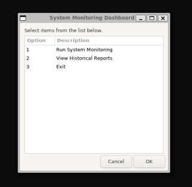
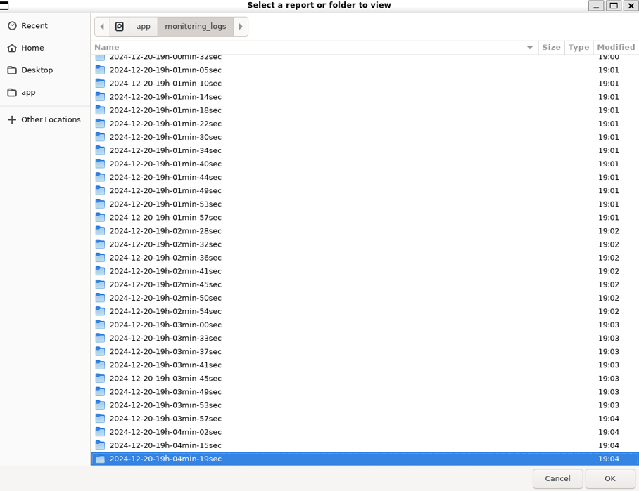
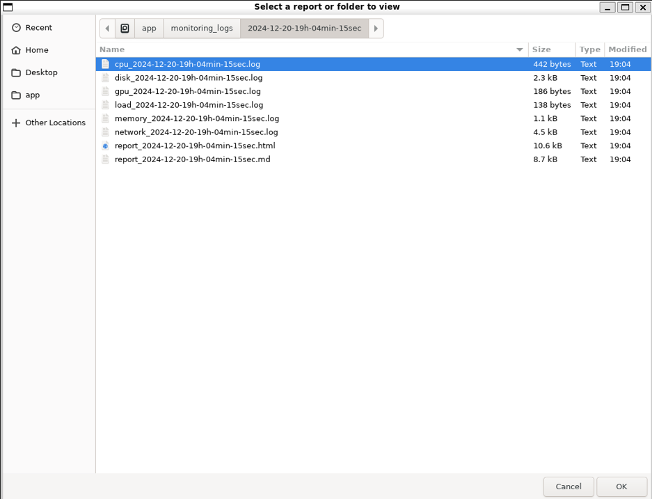
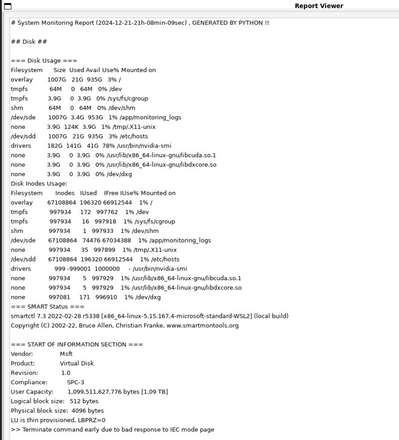
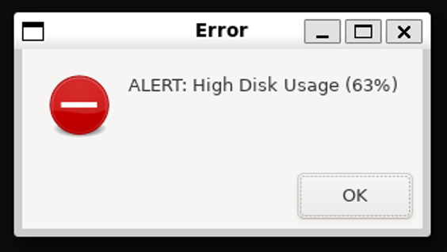
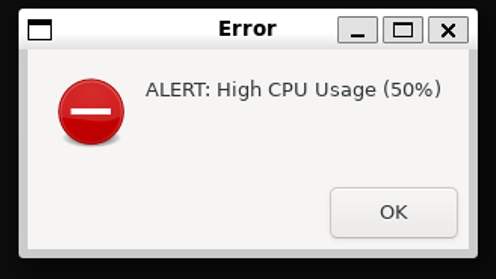

# OS Performance Monitoring & Statistics Project

# System Monitoring Project 

This project delivers a comprehensive system monitoring solution using a **Zenity-based graphical user interface (GUI)**, designed for ease of use and adaptability. It enables users to monitor system performance, hardware health, and generate detailed reports with a **user-friendly dashboard**. To ensure portability and compatibility across various platforms, the project is fully containerized with Docker, simplifying deployment and usage on diverse operating systems and hardware configurations.

## Features
- Real-time monitoring of **CPU, memory, disk, and network metrics**.
- **Alerts** for critical conditions like high CPU/memory usage or low disk space.
- **User-friendly GUI** powered by Zenity for report viewing and system monitoring.
- Generates detailed reports in **Markdown and HTML formats**.
- **Dockerized** for portability and reproducibility.

## Requirements

### For Direct Execution (Without Docker)
Ensure the following packages are installed:
- `sysstat`
- `dos2unix`
- `python3`
- `python3-pip`
- `lm-sensors`
- `smartmontools`
- `zenity`
- `pandoc`
- `curl`
- `net-tools`
- `iproute2`
- `x11-utils`
- `lshw`
- `xdg-utils`
- `chromium`
- `mesa-utils`
- `bc`
- `CUDA Toolkit 11.8`
- `rocm-smi`

Install these packages on Debian/Ubuntu-based systems with:
```bash
sudo apt-get update
sudo apt-get update && sudo apt-get install -y sysstat lm-sensors smartmontools zenity pandoc curl net-tools iproute2 x11-utils lshw xdg-utils chromium mesa-utils bc rocm-smi dos2unix python3 python3-pip
wget https://developer.download.nvidia.com/compute/cuda/repos/debian11/x86_64/cuda-keyring_1.0-1_all.deb
sudo dpkg -i cuda-keyring_1.0-1_all.deb
sudo apt-get update && apt-get install -y
cuda-toolkit-11-8
```

### For Docker Execution
- Visit **https://www.docker.com/** to build and run containers.
- Docker Compose (optional, for orchestration).

## Installation and Setup

### Running Locally (Without Docker) on VMs or WSL 2

1- Ensure that above requirements are installed.

2- Clone the repository:
```bash
git clone https://github.com/MohamedMostafa010/MonitorMetrics.git
cd MonitorMetrics
```

3- Make the script executable:
```bash
chmod +x monitor.sh
```

4- Run the script (one of the two ways):
```bash
./monitor.sh
bash monitor.sh
```

### Running with Docker on VMs or WSL 2
1- Install Docker on Linux (You can also install Docker by following the instructions on the official [**Docker Website**](https://docs.docker.com/engine/install/)):
```bash
sudo apt-get update
sudo apt-get install -y docker.io
```

2- Or on Windows, [**Docker Website**](https://docs.docker.com/engine/install/):
- After installing **Docker Desktop** from the website above, make sure it's running. Docker Desktop provides a Docker daemon that WSL can access.
- Configure **WSL Integration** with Docker Desktop:
  - Open **Docker Desktop**.
  - Go to Settings (the **gear icon in the top-right**).
  - In the General tab, ensure that **Enable the experimental WSL 2-based engine is checked**.
  - Go to the **Resources tab** and then the **WSL Integration section**.
  - Ensure that your WSL distributions (like **Ubuntu**) are enabled to use Docker.
  - Make sure your WSL distributions (e.g., Ubuntu) are selected. You can toggle on the distributions you want to use Docker with (typically, you’ll select the one you’re using, e.g., Ubuntu).
  - Click **Apply & Restart** if you made any changes.
- Check Docker Status in WSL:
```bash
docker --version
docker info
```

3- Build the Docker image:
```bash
docker build -t system-monitor .
```

4- Controlling for the X server in a Unix/Linux environment:
```bash
xhost +local:docker
```

2- Run the container:
```bash
docker run --rm -it --name system-monitor --privileged --device=/dev/sda --env DISPLAY=$DISPLAY -v /tmp/.X11-unix:/tmp/.X11-unix --net=host --gpus all -v /home/user/system_logs:/app/monitoring_logs -v /mnt/c:/mnt/c -v /mnt/d:/mnt/d -v /mnt/e:/mnt/e -v /proc:/host_proc --cpus="4" system-monitor > /dev/null 2>&1
```

4- Running with Docker Compose (Optional)
- Start the service:
```bash
docker-compose up
```
- Stop the service:
```bash
docker-compose down
```

## How to Use

### Launch the Dashboard
**- The script opens a Zenity-based GUI with three options:**
  - **Run System Monitoring:** Collects metrics and generates a report.
  - **View Historical Reports:** Browse and view saved reports.
  - **Exit:** Closes the application.**

**- View Alerts:**
  - Real-time alerts for critical conditions are displayed as Zenity notifications.

**- View Reports:**
  - Reports are saved in the monitoring_logs directory. Select a report through the GUI to view details.

# Screenshots and Visualizations






